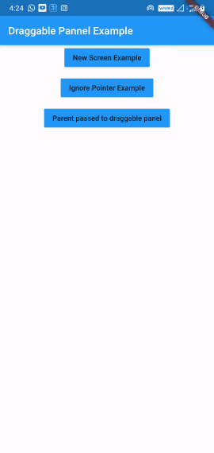
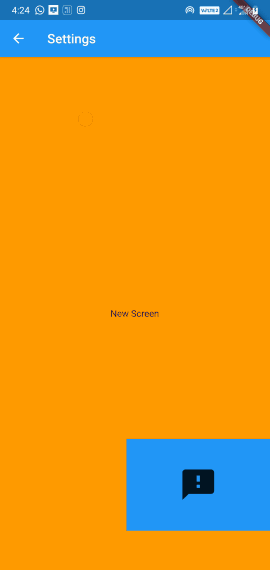

# draggable_panel_flutter
Plugin to replicate the DraggablePanel functionality as in Draggable panel in Android.
When the top widget is dragged to bottom it is scaled down to minimum width and height passed to the widget

### Demo
1) Draggable Panel<br><br>
<br><br>
2) Opening a widget between Parent and Panel (draggable_example_four.dart)<br><br>


### Code
Main class DraggablePanel
```
DraggablePanel(
parent: Container(color: Colors.grey) // optional, this will as the back widget(behind panel)
topChild: Container(color: Colors.blue, alignment: Alignment.center, child: Icon(Icons.filter, size: 50,),),
bottomChild: Container(color:  Colors.red,),)
```
1) You can push it as new screen (But you won't be able to touch the back stack widget)
```
Navigator.of(context).push(TransparentRoute(
  builder: (ctx) => DraggablePanel(
    topChild: Container(color: Colors.blue, alignment: Alignment.center, child: Icon(Icons.filter, size: 50,),),
    bottomChild: Container(color:  Colors.red,),
  )
));
```
2) If you want to touch the back stack widget when the panel is minimized, pass the parent widget-
```
DraggablePanel(
  parent: Container(color:  Colors.grey,)
  topChild: Container(color: Colors.blue, alignment: Alignment.center, child: Icon(Icons.filter, size: 50,),),
  bottomChild: Container(color:  Colors.red,),)
```
### Check "Parent passed to draggable panel" example (draggable_example_four.dart) for proper implementation

With above you will be able to touch parent container and can perform action on the same.
You can also perform operation like show/hide panel, add widgets in between Parent and Panel by accessing the panel state:
```
GlobalKey<DraggableState> _draggableKey = GlobalKey<DraggableState>();
_draggableKey.currentState.show();

// add widget between panel and parent
_draggableKey.currentState.addWidgetInBetween(Scaffold(body: Container(),));

// remove the widget added between panel and parent
_globalKey.currentState.removeWidget(widget);

// Whether panel is shown or hidden
_globalKey.currentState.isShown();

// To hide panel
_globalKey.currentState.hide();

// To show panel. Here if you pass "reset: true", the panel will be reset to default position i.e maximise
_globalKey.currentState.show({reset: bool});

_globalKey.currentState.maximise(); // To maximise the panel
_globalKey.currentState.minimise(); // to minimise the panel

// to reset the panel values, optionally notify this state change to widget
_globalKey.currentState.resetAttributes({notifyStateChange: bool});

// To make panel full screen
_globalKey.currentState.fullScreen();
```
If you pass the DragListener to the widget then you can listen for the state change
```
onMinimised(); // When panel minimised
onMaximised(); // When panel maximised
onFullScreen(); // When panel is in fullscreen mode
onDrag(double dragPosition); // When panel is being dragged
onExit(BuildContext context); // When panel is dragged away either horizontally left or right
You can use this context to either pop the widget or you can call hide & reset method to hide the panel and resetting its state to give exit illusion.
```

Other properties of the DraggablePanel-
  - parent: Parent Widget, widget that you want to place behind the DraggablePanel. Only available in DraggablePanelWithParent class.
  - topChild: The widget you want to show at top of panel
  - bottomChild: The widget you want to show after top widget, that covers the remaining panel area.
  - topChildHeight: The height of the top widget (section)
  - topChildDockWidth(minimum Width): The width when the top widget is dragged down to dock state
  - topChildDockHeight(minimum height): The height when the top widget is dragged down to dock state
  - listener: Listener to get callback when the panel is Dragged, minimised, maximised
  - defaultShow: Initial state of panel show/hide

### Note: As you can see we have to place every widget inside same stack to access the touch event from panel when minimised. I am looking for something which may allow us to pass touch events to back widget without placing them in same stack. In case you find anything let me know.